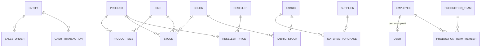
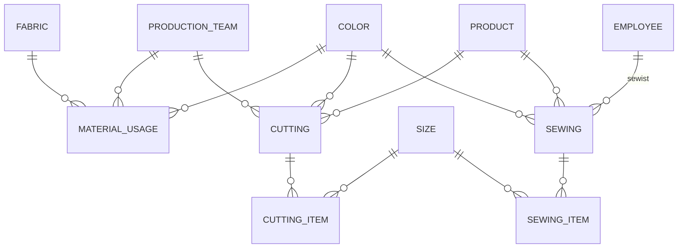
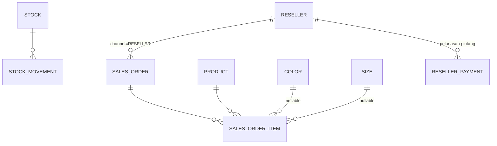
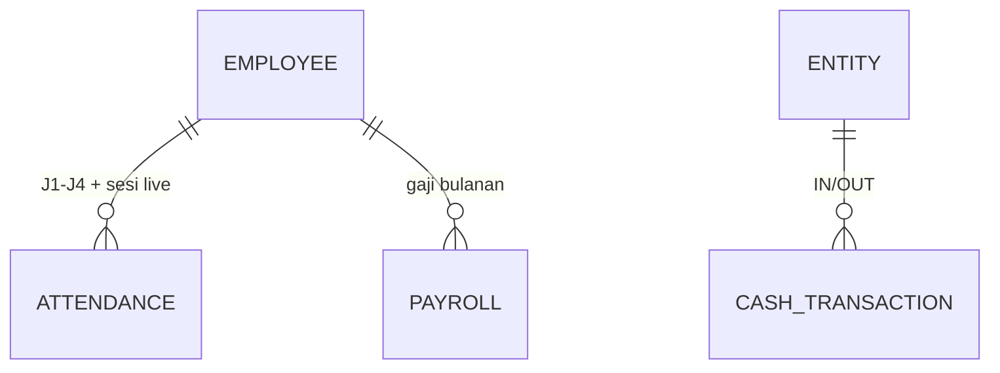

# Skema Database — KonveksiApp (ARKA FASHION)

**File:** `prisma/schema.prisma` · **DB:** PostgreSQL · **Client:** Prisma 7 (generated ke `src/generated/prisma`)
**Sumber desain:** analisis 8 file Excel client (`public/dokumen/`, lihat `REPORT-ANALISIS-DOKUMEN.md`)

**Status:** `npx prisma validate` ✅ valid. Belum migrate/generate — jalankan saat mulai Phase 2:

```bash
npx prisma generate   # update client (aman, tanpa DB)
npx prisma migrate dev --name init_business   # butuh DATABASE_URL
```

**Cakupan:** 35 tabel (6 foundation + 29 bisnis) + 9 enum.

---

## 1. Domain & pemetaan Excel → tabel

| Domain | Tabel | Sumber dokumen Excel |
|---|---|---|
| **Entitas** | `entities` | 2 file cash Flow (Kebaya Authentik, Glamore Kebaya) |
| **Master produk** | `products`, `colors`, `sizes`, `product_sizes` | STOCK `DATA` (warna, model), DROPSHIP (kode+harga) |
| **Master bahan** | `fabrics`, `fabric_stocks`, `material_usages`, `material_purchases`, `suppliers` | PRODUKSI `BAHAN` (kain × warna, roll), alur beli bahan di kas |
| **Master orang** | `employees`, `production_teams`, `production_team_members` | STOCK `DATA` (penjahit, tim cutting), presensi GAJIH |
| **Produksi** | `cuttings`, `cutting_items`, `sewings`, `sewing_items` | PRODUKSI `CUTTING NEW`, `PENJAHIT` (surat jalan, setoran) |
| **Persediaan** | `stocks`, `stock_movements`, `stock_scans` | STOCK `SO/STOK/MASUK/KELUAR`, `Scan Barang` |
| **Penjualan** | `sales_orders`, `sales_order_items`, `resellers`, `reseller_prices`, `reseller_payments` | DROPSHIP `ORDER`, HITUNGAN RESELLER (piutang/bayar) |
| **HR** | `attendances`, `sales_targets`, `payrolls` | HITUNGAN GAJIH (`rumus`, `BONUS`, `RULES`, sheet per orang) |
| **Keuangan** | `cash_transactions` | cash Flow ×2 (masuk/keluar/kwitansi) |

---

## 2. Diagram relasi (ERD per domain)

### 2.1 Master



### 2.2 Produksi



### 2.3 Persediaan & Penjualan



### 2.4 HR & Kas



---

## 3. Kunci & aturan per tabel (ringkas)

### Master
| Tabel | Kunci / aturan |
|---|---|
| `products` | `code` unik = kode dropship (G, GS, KB…). `type`: `GARMENT` (punya ukuran) / `ACCESSORY` (plastik packing — ukuran `ALL`). `basePrice` = harga katalog |
| `colors` | `code` unik, **normalisasi huruf besar** — sumber kebenaran tunggal warna (perbaiki BURGUNDI/BERGUNDI, MARON/MAROON) |
| `sizes` | `code` unik, dua sistem digabung (S/M/L/XL + 4/6/8/10/12/14), `sortOrder` urut tampil |
| `product_sizes` | ukuran **mengikuti model** (PK gabung `productId+sizeId`) — definisikan ukuran per produk |
| `employees` | `code` unik; `position`: `CUTTING`, `SEWIST`, `HOST_LIVE`, `WAREHOUSE`, `SALES`, `ADMIN`; simpan `baseSalary` (1.500.000), `transportAllowance` (100.000), `workdayBasis` (25) |
| `production_teams` | tim cutting pasangan (JIMAT/FERRY…); member lewat `production_team_members` |

### Produksi
| Tabel | Kunci / aturan |
|---|---|
| `material_usages` | per baris = tanggal + tim + kain + warna + roll + jumlah — ganti sheet BAHAN |
| `fabric_stocks` | unik `(fabricId, colorId)`, `qty Decimal` (desimal utk sisa roll) |
| `cuttings` | header (tanggal, tim, model, warna, roll, `surplus` = "Lebih size S") + `cutting_items` qty per ukuran → total dihitung aplikasi |
| `sewings` | header + `suratJalan`, `setorDate`, `setorQty`; **selisih −/+ = Σ items − setorQty** (dihitung, tidak disimpan) |
| `material_purchases` | pembelian bahan ke `suppliers`, `total = qty × unitPrice` dihitung aplikasi |

### Persediaan
| Tabel | Kunci / aturan |
|---|---|
| `stocks` | **unik `(productId, colorId, sizeId)`** — satu baris per varian; wajib punya baris sebelum mutasi |
| `stock_movements` | append-only; `type` `MASUK`/`KELUAR`/`ADJUST`; `refType+refId` menunjuk sumber (order, produksi, scan) |
| `stock_scans` | log raw scanner (kode, qty, waktu, user) → diproses jadi `ADJUST` |

### Penjualan
| Tabel | Kunci / aturan |
|---|---|
| `sales_orders` | `orderNo` unik (TRX-2026-0841 / no order marketplace); `channel`: `SHOPEE`, `TIKTOK`, `LIVE`, `DROPSHIP`, `RESELLER`, `OFFLINE`; `status` `PENDING→…→COMPLETED`; `totalAmount = Σ item` dihitung aplikasi |
| `sales_order_items` | `unitPrice` di-snapshot saat order (harga bisa beda per reseller) |
| `reseller_prices` | PK `(resellerId, productId)` — daftar harga per reseller (REZA beda dari yang lain) |
| `reseller_payments` | kas masuk pelunasan; **piutang berjalan = Σ order RESELLER − Σ pembayaran** (query, bukan kolom) |

### HR
| Tabel | Kunci / aturan |
|---|---|
| `attendances` | unik `(employeeId, date)`; `code`: `WORK`(J1), `LEAVE`(J2), `SICK`, `ABSENT`, `MENSTRUAL`(J3/MERAH), `OVERTIME`(J4); `sesi1..3` = nilai sesi host live |
| `sales_targets` | unik `(year, month)`; `targetPcs` (2000), `targetAmount` (6.875.000), `commissionPct` (2), `upTargetPct` (3) |
| `payrolls` | unik `(employeeId, year, month)`; `total = basePay + transport + overtime + bonus − deduction` dihitung aplikasi; `status` `DRAFT→PAID` |

### Keuangan
| Tabel | Kunci / aturan |
|---|---|
| `cash_transactions` | per entitas per tanggal; `type` `IN`/`OUT`, `amount` selalu positif; `category`: `SALES`, `WITHDRAWAL` (tarik Shopee/TikTok), `MATERIAL`, `PAYROLL`, `OPERATIONAL`, `OTHER`; **saldo berjalan = Σ IN − Σ OUT s.d. tanggal** (tidak disimpan per baris) |

---

## 4. Keputusan desain

1. **Uang = `Int` Rupiah bulat.** Total per baris < Rp2,1 M (batas Int32) — kas berjalan dihitung via agregat, bukan disimpan, jadi aman. Naik ke `Decimal` hanya jika ada nominal > 2,1 M per baris.
2. **Selisih/delta tidak disimpan** (cutting−, jahit−/+): dihitung aplikasi dari data sumber — hindari drift data.
3. **Enum Prisma dipakai** (Postgres) — channel, status, kode presensi, kategori kas. Tambah channel baru = tambah nilai enum + migrate.
4. **Warna & ukuran dipaksa lewat tabel referensi** — tulisan bebas di Excel dilarang, menyelesaikan inkonsistensi varian.
5. **Akses via RBAC Phase 1** — semua aksi tulis di app harus lolos `requirePermission()`; `audit_logs` generik tetap dipakai (module `produksi`/`penjualan`/dst).
6. **Cash flow dua entitas** — 2 file Excel kembar dikonfirmasi dulu ke client (pertanyaan #2 di report); jika ternyata hanya satu entitas, cukup 1 baris `entities`.

## 5. Belum diputuskan (tergantung jawaban client)

| Pertanyaan | Dampak skema |
|---|---|
| SO = Surat Order atau Stok Opname? | Jika Stok Opname → tambah model `stock_opnames` + item, bukan pakai `sales_orders` |
| SESI 1–3 = pcs atau jam? | tipe kolom `sesi1..3` (kini `Int`) |
| Bonus reseller/dropship selain piutang? | tabel `commissions` (belum dibuat — YAGNI) |
| Plat packing termasuk stok bahan? | daftarkan sebagai `products` type `ACCESSORY` + mutasi stok, atau `fabrics` |

## 6. Langkah berikut (Phase 2)

1. `npx prisma generate` (client sinkron).
2. Isi `DATABASE_URL` di `.env` → `npx prisma migrate dev --name init_business`.
3. Seed: colors (14), sizes, products+product_sizes (dari sheet DATA/DROPSHIP), fabrics, employees, teams, entities, roles/permissions.
4. Pilih modul pertama: **Master Produk** (paling mandiri) atau **Persediaan** (inti alur).
